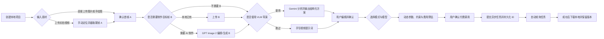

# MorphFlow 产品需求文档（PRD）

> 文档状态：Draft v0.1<br>
> 更新日期：2026-08-09<br>
> 产品形态：本地优先的个人 AI 视频转场 Web 工作台<br>
> 需求来源：用户访谈与 [`message.md`](../message.md) 中的 DMXAPI 接口资料<br>
> 说明：本文是产品与验收的唯一主依据。模型接口的实时可用性、价格和未明确字段仍须通过官方资料与小额连通测试验证。

## 1. 产品摘要

MorphFlow 帮助用户把实拍视频或本地图片延展为 AI 视频转场。用户可以从实拍视频中手动选择高清尾帧，也可以直接上传图片或手绘草图；随后可选择使用 GPT Image 2 制作目标帧、使用 Gemini VLM 生成导演方案和模型专用提示词，最后手动选择视频模型与生成模式，在确认参数和预计费用后提交任务。

AI 生图和 VLM 导演都是可选辅助步骤。产品的核心不是自动替用户做决定，而是统一管理素材、模型能力、模型专属参数、提示词版本、费用、异步任务和生成结果。

## 2. 背景与问题

当前 AI 转场创作通常要在剪辑软件、生图工具、聊天模型和多个视频模型之间切换。不同模型的输入方式、模式、参数、价格、异步查询方式和结果链接有效期各不相同，导致以下问题：

- 用户需要反复上传和整理同一批素材。
- 单图、首尾帧、多参考、多模态和主体控制容易混淆。
- 通用提示词无法直接适配不同视频模型。
- 参数组合可能无效，但供应商往往只在提交后返回错误。
- 生成前难以知道预计费用，失败或重复提交可能造成额外扣费。
- task_id、video_id 和临时结果 URL 容易丢失。
- API Key 容易被误写进代码、日志或 GitHub。

MorphFlow 要把这些差异封装为清晰、可验证、可追溯的本地创作流程。

## 3. 目标用户与使用环境

### 3.1 目标用户

- 单一用户：产品拥有者本人。
- 有视频拍摄和基础剪辑经验。
- 希望控制创作方向，不希望系统自动替代关键决策。
- 愿意使用多个第三方模型比较效果，但需要明确能力和成本。

### 3.2 默认使用环境

- macOS 优先。
- 本地启动服务，通过浏览器访问 localhost。
- 项目、数据库、图片和视频默认保存在本机。
- 只有用户确认生成后，必要素材才发送到 DMXAPI 及其上游模型。

## 4. 产品原则

1. **用户掌控**：不自动选择模型，不自动调用多个模型，不自动覆盖用户提示词。
2. **步骤可跳过**：GPT Image 2 和 Gemini 导演均不是必经步骤。
3. **能力真实**：仅展示文档或真实测试确认的模型能力，不把推测标成支持。
4. **参数完整**：每个已接入模型的已确认模式和参数都应有产品入口；低频参数可以折叠，但不能静默丢弃。
5. **提交可知**：任何可能扣费的调用都要先显示模型、模式、参数和预计费用并由用户确认。
6. **避免重复扣费**：异步任务可自动轮询，但不盲目自动重提生成请求。
7. **本地优先**：原始素材、项目数据和成功结果默认保存在本地。
8. **凭据最小暴露**：API Key 不进入前端持久存储、数据库、日志、URL、文档和 Git。
9. **过程可追溯**：原始素材、派生图片、导演方案、提示词版本、请求参数和结果保持关联，不覆盖原件。

## 5. 术语

| 术语 | 定义 |
|---|---|
| A / 首帧 | AI 生成视频的起始图片，常来自实拍视频尾帧 |
| B / 目标帧 / 尾帧 | 希望 AI 转场最终到达的画面，可本地上传或由 GPT Image 2 生成 |
| 参考图 | 用于人物、风格、构图、材质、灯光或特效参考，但不一定成为首尾帧 |
| I2V | 单图生视频，通常只固定首帧 |
| FLF / 首尾帧 | 同时给出 A 和 B，要求视频从 A 连续运动到 B |
| R2V | 多参考图或参考素材驱动的视频生成 |
| 导演方案 | VLM 输出的创作摘要、镜头语言、运动、节奏、时间线、风险和模型专用提示词 |
| 模型模式 | 某模型的一种明确调用能力，如 Kling 首尾帧、Kling 多镜头或 H3 多模态参考 |
| 模型注册表 | 描述模型模式、输入槽位、参数、约束、价格和接口适配信息的配置层 |

## 6. 目标与非目标

### 6.1 MVP 目标

- 建立本地项目并导入实拍视频、图片或手绘草图。
- 从实拍视频中手动逐帧定位并导出 A，或直接上传 A。
- 可跳过生图直接上传 B，或调用 GPT Image 2 制作 B。
- 可跳过导演直接写提示词，或调用 Gemini 生成结构化导演方案。
- 同时支持“先选模式再选模型”和“先选模型再选模式”。
- 根据模型与模式动态渲染完整参数、输入槽位和限制。
- 提交前校验素材、参数和交叉约束，并计算预计费用。
- 统一提交、轮询、失败处理、结果下载和版本对比。
- 保护本地 API Key，避免凭据进入 GitHub。

### 6.2 MVP 非目标

- 不做多用户、账号、权限和团队协作。
- 不做云端项目同步或云数据库。
- 不做自动模型推荐或自动质量评分。
- 不自动并行生成多个模型结果。
- 不接 Seedance 2.0。
- 不把模型生成结果宣称为已验证事实或自动最佳结果。
- 首版不强制自动拼接实拍视频和 AI 转场片段。

## 7. 核心用户流程



## 8. 信息架构与主界面

### 8.1 全局区域

- **项目**：创建、打开、重命名和查看最近项目。
- **任务队列**：查看所有生成任务、状态、模型、费用和错误。
- **成本记录**：展示估算成本、供应商返回用量和用户确认记录。
- **设置**：DMXAPI 配置、密钥状态、本地存储路径、FFmpeg 状态和日志级别。

### 8.2 创作工作台

```text
┌─────────────────────────────────────────────────────────────┐
│ MorphFlow   当前项目   任务队列   成本记录   设置              │
├──────────────┬────────────────────────────┬─────────────────┤
│ 素材与步骤    │                            │ 动态检查器       │
│              │       主预览画布            │                 │
│ 1 实拍素材    │  视频 / A-B 对比 / 结果预览  │ 生成模式         │
│ 2 目标帧      │                            │ 模型             │
│ 3 VLM 导演    ├────────────────────────────┤ 模型专属参数     │
│ 4 视频生成    │ 时间轴 / 逐帧选择 / 提示词   │ 限制与预计费用   │
│ 5 结果导出    │                            │ 确认生成按钮     │
├──────────────┴────────────────────────────┴─────────────────┤
│ 结果版本与任务：版本 1 | 版本 2 | 版本 3 | 生成状态            │
└─────────────────────────────────────────────────────────────┘
```

### 8.3 可跳过步骤的呈现

- 目标帧步骤允许“本地上传”“GPT Image 2 制作”“不使用尾帧”三种状态。
- VLM 导演允许“使用导演”“手写提示词”“沿用已确认版本”三种状态。
- 被跳过的步骤显示原因和恢复入口，不阻断后续生成。

## 9. 功能需求

### 9.1 项目与素材管理

| 编号 | 优先级 | 需求 |
|---|---|---|
| PRJ-001 | P0 | 用户可以创建本地项目，名称可修改，系统生成稳定项目 ID。 |
| PRJ-002 | P0 | 项目保存创建时间、更新时间、默认画幅、素材、提示词、任务和结果关联。 |
| PRJ-003 | P0 | 导入素材时复制到项目媒体目录或建立受控引用，不覆盖源文件。 |
| PRJ-004 | P0 | 支持 JPEG、JPG、PNG、WEBP；其他模型特有格式按能力注册表开放。 |
| PRJ-005 | P0 | 支持常见 MP4/MOV 视频导入，并使用 ffprobe 读取时长、分辨率、帧率、编码和音轨。 |
| PRJ-006 | P1 | 支持素材备注和产品内部角色：首帧、目标帧、人物、风格、构图、材质、灯光、特效。 |
| PRJ-007 | P0 | 删除派生素材前显示引用关系；不允许静默删除仍被任务或版本引用的文件。 |

### 9.2 实拍视频与尾帧 A

| 编号 | 优先级 | 需求 |
|---|---|---|
| FRM-001 | P0 | 用户可以上传前半段实拍视频，或跳过视频直接上传 A。 |
| FRM-002 | P0 | 视频时间轴支持拖动、精确时间输入、上一帧/下一帧和末帧跳转。 |
| FRM-003 | P0 | 系统只按用户选择位置提取原分辨率图片，不自动替用户选择关键帧。 |
| FRM-004 | P0 | 提取前显示时间戳、帧号、分辨率和预计输出格式。 |
| FRM-005 | P0 | A 被替换时保留旧版本及其历史任务关联。 |
| FRM-006 | P1 | 提供“最后 1–3 秒运动预览”，供用户或 VLM 理解实拍镜头惯性。 |

### 9.3 可选的 AI 目标帧模块

| 编号 | 优先级 | 需求 |
|---|---|---|
| IMG-001 | P0 | 用户可选择直接上传 B、上传手绘草图作为 B、调用 GPT Image 2 制作 B，或不使用 B。 |
| IMG-002 | P0 | GPT Image 2 调用名默认使用 `gpt-image-2-03`，实际可用性须在连通测试时验证。 |
| IMG-003 | P0 | 支持一张编辑主图和多张参考图；参考图顺序稳定保存。 |
| IMG-004 | P0 | 产品内部参考角色通过提示词和图片顺序表达，不向供应商发送不存在的 role 参数。 |
| IMG-005 | P0 | 用户输入原始意图后可调用“AI 优化”，优化结果不得自动覆盖原文。 |
| IMG-006 | P0 | 展示原始提示词、优化提示词和最终提交提示词，并允许手动编辑。 |
| IMG-007 | P0 | 展示尺寸、质量、格式、参考图数量、生成张数和预计费用。 |
| IMG-008 | P0 | 生成前必须二次确认；当前资料下 `gpt-image-2-03` 默认 `n=1`。 |
| IMG-009 | P0 | 结果落地本地，保存模型名、参数、提示词、输入素材、请求时间和成本。 |
| IMG-010 | P1 | 支持从多个图片结果中选择一个作为当前 B，同时保留未选结果。 |

### 9.4 可选的 Gemini VLM 导演

| 编号 | 优先级 | 需求 |
|---|---|---|
| DIR-001 | P0 | 用户可跳过 VLM，直接输入视频提示词。 |
| DIR-002 | P0 | 导演默认分析 A、可选 B、用户意图和目标时长；可选附加实拍视频最后几秒。 |
| DIR-003 | P0 | 默认模型调用名为 `gemini-3.6-flash`，实际可用性通过连通测试验证。 |
| DIR-004 | P0 | 使用结构化 JSON Schema 输出；解析失败时保留原始响应并允许重试分析，不影响手写提示词。 |
| DIR-005 | P0 | 输出包含创作摘要、转场策略、镜头运动、主体运动、环境运动、节奏、时间线、风险和模型专用提示词。 |
| DIR-006 | P0 | 同一次导演方案可以包含多个模型提示词，但不会自动调用这些模型。 |
| DIR-007 | P0 | 用户可编辑导演结果并创建新版本；原始模型输出不可覆盖。 |
| DIR-008 | P0 | 生成视频前必须明确选择使用哪个导演版本或手写版本。 |
| DIR-009 | P1 | 为首尾构图、比例、人物一致性和不可能运动提供非阻断风险提示。 |

建议的导演输出合同：

```json
{
  "creativeSummary": "string",
  "transitionStrategy": "string",
  "camera": {
    "movement": "string",
    "framing": "string",
    "speedCurve": "string"
  },
  "subjectMotion": "string",
  "environmentMotion": "string",
  "timeline": [
    { "startSeconds": 0, "endSeconds": 1.5, "action": "string" }
  ],
  "risks": [
    { "severity": "info|warning", "message": "string", "suggestion": "string" }
  ],
  "modelPrompts": {
    "model-id": {
      "positivePrompt": "string",
      "negativePrompt": "string|null",
      "parameterSuggestions": {}
    }
  }
}
```

### 9.5 模式与模型选择

| 编号 | 优先级 | 需求 |
|---|---|---|
| MOD-001 | P0 | 用户可先选模式，系统筛选支持该模式的模型。 |
| MOD-002 | P0 | 用户可先选模型，系统展示该模型所有已确认模式。 |
| MOD-003 | P0 | 模型卡片展示模式徽标、输入要求、时长、分辨率、音频、参考能力、价格摘要和验证状态。 |
| MOD-004 | P0 | 模型模式切换后，动态更换输入槽位和参数，不保留无效隐藏值。 |
| MOD-005 | P0 | 资产不满足模式要求时禁用提交，并明确说明缺少什么。 |
| MOD-006 | P0 | 不支持的模型不从注册表猜测能力；可显示“未接入”但不能允许提交。 |
| MOD-007 | P1 | 用户可收藏常用模型模式和参数预设。 |

### 9.6 动态参数系统

| 编号 | 优先级 | 需求 |
|---|---|---|
| PAR-001 | P0 | 参数 UI 由模型模式定义生成，不使用覆盖所有模型的固定表单。 |
| PAR-002 | P0 | 支持字符串、长文本、整数、浮点数、布尔、枚举、图片、视频、音频、素材列表、结构化镜头列表和主体列表。 |
| PAR-003 | P0 | 每个字段包含标签、说明、默认值、必填、范围、枚举、单位和高级设置标识。 |
| PAR-004 | P0 | 支持交叉字段约束、互斥、依赖、条件必填和动态选项。 |
| PAR-005 | P0 | 禁用值必须展示原因，例如“Paiwo 1080p 不支持 10 秒”。 |
| PAR-006 | P0 | 常用参数直接展示，高级参数折叠展示，但已确认参数不得丢失。 |
| PAR-007 | P0 | 提交前使用同一 Schema 在前端和后端重复验证；后端结果为最终依据。 |
| PAR-008 | P0 | 模型文档或适配器更新后旧任务仍保留当时的模型定义版本和参数快照。 |

## 10. MVP 模型能力矩阵

`支持` 表示现有资料确认；`待验证` 表示接口或字段需真实请求校准；`不适用` 表示产品不为该模型暴露该模式。

| 模型 | 文生 | 单图 | 首尾帧 | 多参考/多模态 | 多镜头/主体 | 音频 | 状态 |
|---|---:|---:|---:|---:|---:|---:|---|
| `kling-v3` | 支持 | 支持 | 支持 | 主体控制 | 支持 | 支持 | MVP |
| `viduq3-pro` | 支持 | 支持 | 支持 | 不作为首版重点 | 不适用 | 支持 | MVP |
| `MiniMax-H3` | 文档目录支持 | 支持 | 支持 | 支持图/视频/音频 | 不适用 | 参考音频 | MVP |
| `happyhorse-1.1-i2v` | 不适用 | 支持 | 不支持 | 不支持 | 不适用 | 文档描述支持音画能力，参数待验证 | MVP |
| `happyhorse-1.1-r2v` | 不适用 | 参考驱动 | 不支持 | 1–9 张参考图 | 不适用 | 待验证 | MVP |
| `paiwo-v5.6-itv` | 不适用 | 支持 | 不支持 | 不支持 | 不适用 | 支持，真实行为待验证 | MVP |
| `paiwo-v5.6-itv2` | 不适用 | 不适用 | 支持 | 不支持 | 不适用 | 支持字段，真实行为待验证 | MVP |
| Seedance 2.0 | — | — | — | — | — | — | 排除 |

## 11. 模型专属参数要求

### 11.1 Kling V3

- 模式：文生单镜头、文生多镜头、首帧、首尾帧、主体控制、图生多镜头。
- 模式档位：std、pro、4K。
- 时长：3–15 秒。
- 参数：正向提示词、负面提示词、sound、cfg_scale、duration、watermark_info。
- 多镜头：最多 6 个分镜；每个分镜有 index、prompt、duration；分镜时长总和必须等于任务总时长。
- 主体控制：最多 3 个主体；按文档处理 element_list、voice_list 的互斥及提示词引用语法。
- 查询模型：`kling-v3-get-all`。

### 11.2 Vidu Q3 Pro

- 模式：文生、单图、首尾帧。
- 时长：1–16 秒。
- 分辨率：540p、720p、1080p。
- 参数：prompt/input、audio、is_rec、duration、resolution、seed、watermark、wm_position、wm_url。
- 单图只允许一张；首尾帧第一张为首帧、第二张为尾帧。
- 首尾帧分辨率应相近，比例约束按供应商文档校验。
- 查询模型：`vidu-get`；当前文档查询采用 SSE，适配器需转换为统一结果。

### 11.3 MiniMax H3

- 模式：首帧、尾帧、首尾帧、多模态参考。
- 分辨率：768P、2K。
- 时长：4–15 秒，最终枚举以连通测试和官方资料为准。
- 首尾帧输入使用 `first_frame` / `last_frame` role。
- 多模态参考支持最多 9 张参考图、最多 3 个参考视频和最多 3 个参考音频；具体大小和时长按注册表校验。
- 首尾帧角色与 reference_image/reference_video/reference_audio 互斥。
- 查询模型：`MiniMax-H3-get`。

### 11.4 HappyHorse 1.1

- I2V：一张 `first_frame`，3–15 秒，720P/1080P。
- R2V：1–9 张 `reference_image`，提示词通过 `[Image 1]` 等引用对应数组顺序。
- R2V 比例：16:9、9:16、3:4、4:3、4:5、5:4、1:1、9:21、21:9。
- 参数：prompt、resolution、duration、watermark、seed；仅在对应模式展示 ratio。
- 查询模型：`happyhorse-get`；task_id 和结果 URL 文档标注 24 小时有效。

### 11.5 Paiwo V5.6

- ITV：一张图片先通过 `paiwo-picture` 上传获得 `img_id`。
- ITV2：首帧和尾帧分别上传，使用 `first_frame_img` 与 `last_frame_img`。
- 时长：5、8、10 秒。
- 分辨率：360p、540p、720p、1080p。
- 约束：1080p 不允许 10 秒；fast 不允许 8 秒。
- 参数：input、duration、quality、motion_mode、seed、generate_audio_switch；ITV 文档另有 negative_prompt，ITV2 在确认前不发送该字段。
- 查询模型：`paiwo-get`；成功示例 status=5，但完整状态码必须通过真实响应或官方说明补齐。

## 12. 模型注册表要求

注册表必须将产品能力与供应商协议分离。建议的技术中立结构：

```ts
type ModelDefinition = {
  id: string
  displayName: string
  provider: "dmxapi"
  category: "director" | "image" | "video"
  enabled: boolean
  verification: "documented" | "smoke-tested" | "disabled"
  definitionVersion: string
  modes: ModelModeDefinition[]
}

type ModelModeDefinition = {
  id: string
  displayName: string
  capabilities: string[]
  inputSlots: InputSlotDefinition[]
  parameterSchema: unknown
  crossFieldRules: unknown[]
  pricing: PricingDefinition
  submitAdapter: string
  queryAdapter?: string
  resultTtl?: string
}
```

每个模式至少要定义：

- 必需和可选输入槽位。
- 支持的本地文件格式、大小、尺寸、比例、数量和媒体时长。
- 全部已确认参数及默认值。
- 交叉约束与人类可读的禁用原因。
- 价格单位、公式、币种、数据来源和生效日期。
- 认证格式、请求协议、提交解析、查询解析和错误归一化。
- 模式验证状态与最后一次真实测试时间。

## 13. 费用预估与确认

| 编号 | 优先级 | 需求 |
|---|---|---|
| CST-001 | P0 | 参数变化时实时更新预计费用。 |
| CST-002 | P0 | 区分按次、按秒、整段阶梯价、输入素材价和额外参考图费用。 |
| CST-003 | P0 | 每条价格记录包含来源和生效日期；未确认价格标为“待确认”，不得伪装成准确价格。 |
| CST-004 | P0 | 提交确认框展示模型、模式、时长、分辨率、音频、数量和预计总价。 |
| CST-005 | P0 | 用户确认记录与任务关联；参数变化后原确认失效，必须再次确认。 |
| CST-006 | P0 | 保存供应商返回的 usage、credits、final deduction 等原始字段，但不擅自把 token 数换算成价格。 |
| CST-007 | P1 | 展示项目累计估算成本与已知实际成本，二者明确区分。 |

## 14. 异步任务与统一状态

统一状态：

```text
draft
awaiting_confirmation
submitting
queued
running
succeeded
failed
cancelled
unknown
result_expired
```

| 编号 | 优先级 | 需求 |
|---|---|---|
| JOB-001 | P0 | 生成提交返回后立即保存供应商任务 ID、模型、模式、参数快照和原始响应。 |
| JOB-002 | P0 | 同一个已成功提交的任务只能轮询，不能因页面刷新重复提交。 |
| JOB-003 | P0 | 自动轮询遵循各模型建议间隔，并支持指数退避；轮询不产生新生成任务。 |
| JOB-004 | P0 | 提交请求出现网络超时且无法确定是否已创建任务时，标为 unknown，不自动重提。 |
| JOB-005 | P0 | 保存供应商原始状态和归一化状态；未知值不得错误映射为失败或成功。 |
| JOB-006 | P0 | succeeded 后立即下载结果到本地临时文件，校验后原子移动到结果目录。 |
| JOB-007 | P0 | 下载失败不改变供应商任务成功事实，状态显示“生成成功，下载失败”并允许重试下载。 |
| JOB-008 | P0 | failed 时展示供应商错误、可操作建议和是否可能扣费，不自动重新生成。 |
| JOB-009 | P1 | 应用重启后恢复未完成任务的轮询。 |

## 15. 结果与导出

| 编号 | 优先级 | 需求 |
|---|---|---|
| OUT-001 | P0 | 同一创作可保存多个结果版本，并展示缩略图、模型、参数、Seed、提示词、时间和成本。 |
| OUT-002 | P0 | 支持单独播放、A/B 对比和下载原始 AI 转场片段。 |
| OUT-003 | P0 | 结果下载后记录本地路径、文件大小、分辨率、时长、帧率、编码和音轨。 |
| OUT-004 | P0 | 用户可标记“选用版本”，但不删除其他版本。 |
| OUT-005 | P1 | 支持导出项目清单，包含素材关系、提示词、参数和结果路径，不包含 API Key。 |
| OUT-006 | P2 | 自动拼接实拍视频与 AI 转场，处理尺寸、帧率、编码、音轨和淡入淡出。 |

## 16. 设置与凭据安全

| 编号 | 优先级 | 需求 |
|---|---|---|
| SEC-001 | P0 | API Key 仅通过本地设置页提交到本地后端。 |
| SEC-002 | P0 | Key 优先保存到 macOS Keychain；SQLite 仅保存“已配置”和末四位等非敏感状态。 |
| SEC-003 | P0 | 前端不得把 Key 写入 localStorage、sessionStorage、IndexedDB、URL 或错误报告。 |
| SEC-004 | P0 | 服务端日志、请求快照和错误信息必须脱敏 Authorization、Cookie、签名 URL 和疑似 Token。 |
| SEC-005 | P0 | `.env`、`.env.*`、本地数据库、上传、输出、日志和临时文件必须进入 `.gitignore`；保留无秘密的 `.env.example`。 |
| SEC-006 | P0 | 推送前检查 Git 已跟踪文件、真实 diff 和凭据扫描结果。 |
| SEC-007 | P0 | 设置页提供“测试连接”，只做低成本或无付费的最小请求，并明确测试行为。 |
| SEC-008 | P0 | 不在产品中保存 DMXAPI 系统访问令牌；MVP 不查询账户余额。 |
| SEC-009 | P1 | 提供清除本地凭据的入口，并明确不会删除 DMXAPI 平台上的 Key。 |

## 17. 本地数据模型

建议实体：

- `Project`：项目基础信息、默认画幅、本地根目录。
- `Asset`：原始或派生媒体、类型、角色、来源、路径、媒体元数据和哈希。
- `AssetRelation`：实拍视频到 A、A 与参考图到 B、输入素材到任务的关系。
- `PromptVersion`：用途、原始文本、优化文本、最终文本、模型和版本来源。
- `DirectorPlan`：结构化导演输出、原始响应、Schema 版本和人工修改。
- `ModelDefinitionSnapshot`：任务创建时的模型能力与价格快照。
- `GenerationDraft`：未提交的模式、模型、素材和参数。
- `CostConfirmation`：用户确认时的配置、估价和时间。
- `GenerationJob`：供应商任务 ID、统一状态、原始状态、请求/响应脱敏快照。
- `GenerationResult`：远程 URL、本地文件、媒体元数据和选用状态。
- `AppSetting`：非敏感设置；不保存完整 Key。

所有写入都应使用稳定 ID 和事务，避免任务已扣费但 ID 未落库。

## 18. 错误处理

### 18.1 HTTP 与通用错误

- 400：展示具体字段错误并定位到动态表单。
- 401/403：提示检查本地 Key 或令牌额度，不打印 Key。
- 404/503：检查端点和精确模型名，标记模型可能不可用。
- 413：提示素材或请求体过大，建议压缩或使用受控 URL 上传路径。
- 429：提示上游限流；查询可以退避，生成提交不得在未知结果下自动重试。
- 500/504/524：保留原始错误和 request ID；是否重试由请求是否可能已经创建任务决定。

### 18.2 素材错误

- 文件不存在或读取失败。
- 格式、大小、尺寸、比例或数量不满足当前模式。
- 首尾帧比例或分辨率差异过大。
- Base64 后请求体超过端点限制。
- 外部 URL 不可访问、过期或返回错误 MIME。

### 18.3 结果错误

- 任务成功但结果 URL 缺失。
- 结果 URL 过期。
- 下载中断、校验失败或磁盘空间不足。
- 响应结构与文档不一致：保存脱敏原始响应，标记 adapter_parse_error，不丢失任务 ID。

## 19. 非功能需求

- 本地页面基础交互应在 200ms 内反馈，不等待远程模型才更新 UI。
- 大文件上传、转码、截帧和下载不得阻塞主 UI。
- 应用重启后项目、草稿、任务和结果可恢复。
- 所有第三方请求设置明确的连接和响应超时。
- 媒体任务写入临时文件后校验并原子移动，避免半文件被当成成功结果。
- 数据库升级使用版本化迁移；不得通过删除数据库解决迁移问题。
- UI 对禁用控件提供原因，对错误提供下一步操作。
- 关键公共边界使用明确类型，不把供应商原始 JSON 直接传遍 UI。

## 20. MVP 验收标准

### 20.1 无 Key 也能完成的验收

- 创建项目并重新打开。
- 导入实拍视频并手动逐帧截取 A。
- 直接上传 A、B、参考图和手绘草图。
- 跳过 GPT Image 2 和 Gemini，使用手写提示词进入生成配置。
- 模式与模型互相筛选正确。
- 每个 MVP 模型展示其已确认的全部模式和参数。
- 交叉约束能在提交前阻止无效组合并解释原因。
- 费用预估对已知价格正确，对未知价格明确显示待确认。
- 页面刷新后草稿不丢失。
- Key 不出现在前端存储、SQLite、日志和 Git 扫描中。

### 20.2 需要本地 Key 和用户批准成本的验收

- Gemini 最小文本请求成功。
- Gemini 对一张图片输出符合 Schema 的导演方案。
- Gemini 对短视频完成分析，或明确记录真实限制和失败原因。
- GPT Image 2 使用一张主图和参考图生成一个 B 并落地本地。
- Paiwo 上传两张图片，ITV2 提交成功，video_id 立即落库。
- 应用自动查询 Paiwo 任务，成功后下载视频并读取媒体信息。
- 至少一个 Kling/Vidu/H3 首尾帧任务成功完成完整链路。
- 真实响应与适配器不一致时，任务 ID 和脱敏原始响应仍可恢复。

## 21. 连通测试顺序与成本控制

1. Gemini 最小文本请求：验证 Key、Base URL 和准确模型名。
2. Gemini JSON Schema：验证结构化输出。
3. Gemini 单图分析。
4. Gemini 短视频分析。
5. GPT Image 2 单次低风险编辑；调用前显示固定预计价格。
6. Paiwo `paiwo-picture` 上传两张非敏感测试图。
7. Paiwo ITV2 使用 5 秒、最低可用分辨率、默认关闭音频生成一次。
8. Paiwo `paiwo-get` 查询、状态映射和结果下载。
9. 按用户批准顺序验证 Kling、Vidu、MiniMax H3 和 HappyHorse。

任何产生费用的步骤都要单独确认。测试不得使用用户不愿外发的真实私人素材。

## 22. 实施阶段

### 阶段 A：产品与架构

- 用户复核本文。
- 检查 GitHub 仓库和现有代码。
- 核验技术依赖当前版本、许可证和维护状态。
- 输出技术设计、目录结构、数据模型和适配器合同。

### 阶段 B：本地安全基础

- 建立 `.gitignore`、环境示例和凭据扫描。
- 建立本地媒体目录、SQLite 迁移和 Keychain 服务。
- 建立脱敏日志和统一错误合同。

### 阶段 C：创作工作台

- 项目与素材。
- 视频预览与手动逐帧截取。
- A/B 和参考图管理。
- 提示词版本与可选导演流程。
- 动态模型/模式/参数 UI。

### 阶段 D：模型与任务

- DMXAPI 通用客户端。
- 模型注册表和价格引擎。
- Gemini、GPT Image 2 和视频模型适配器。
- 异步任务、轮询、恢复和本地下载。

### 阶段 E：验收

- 无 Key 的本地功能测试。
- 经批准的小额连通测试。
- 主流程端到端测试、凭据扫描和文档复核。

## 23. 已知待验证事项

- `gemini-3.6-flash` 的精确 DMXAPI 文档、价格和账户可用性。
- `gpt-image-2-03` 与文档示例中 `gpt-image-2` / `gpt-image-2-ssvip` 的真实调用差异。
- Paiwo ITV2 的准确价格、完整 status 映射、negative_prompt 和音频行为。
- Vidu、Kling、HappyHorse 等结果 URL 的真实有效期和失败收费规则。
- DMXAPI 文档中认证是否需要裸 Token 或 Bearer，必须以端点真实测试锁定。
- GitHub 仓库当前结构和既有实现尚未在本地安全检出。

## 24. PRD 变更规则

- 新需求先判断是否改变 MVP 范围、成本、安全或数据结构。
- 产品行为变化必须更新对应需求编号和验收标准。
- 模型文档更新只改变模型注册表时，不应迫使重写核心 UI。
- 真实接口响应与本文冲突时，保留响应证据，更新“已知待验证事项”和适配器测试，不静默修改历史任务。
- 未经用户批准，不扩大到公网部署、云存储、团队协作或自动付费生成。
