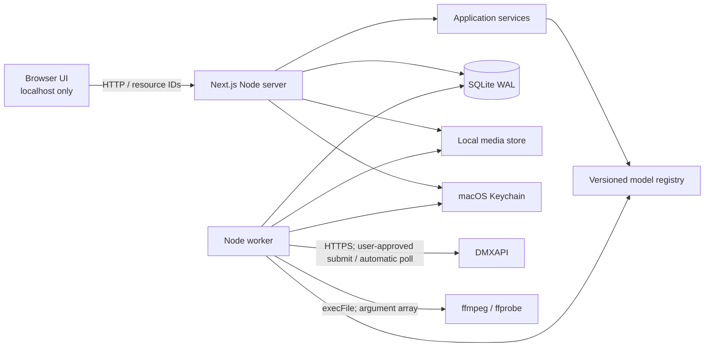
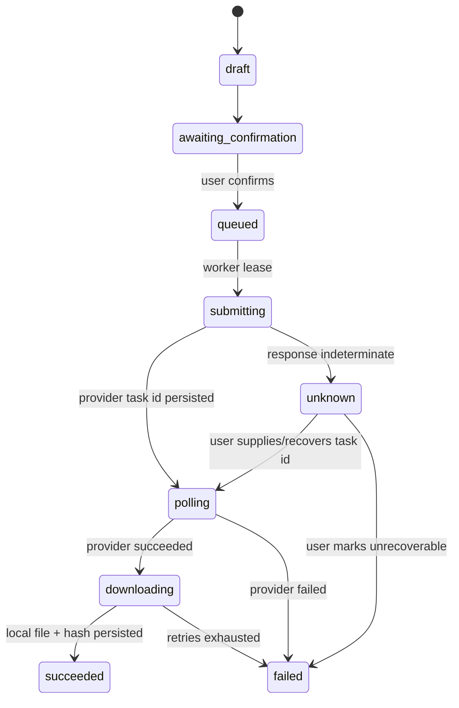

# MorphFlow 技术设计

> 状态：Accepted for MVP implementation<br>
> 日期：2026-08-09<br>
> 对应产品文档：[MorphFlow PRD](./MorphFlow-PRD.md)<br>
> 范围：本地优先、macOS 优先、单用户 Web 工作台

## 1. 结论

MVP 采用一个 TypeScript 仓库，由 Next.js Web 进程和独立 Node.js Worker 共享领域代码、SQLite 数据库与本地文件目录：

- Node.js 24 LTS；不使用本机当前已 EOL 的 Node.js 23 作为基准。
- Next.js 16 App Router、React、TypeScript。
- SQLite WAL + Drizzle ORM + `better-sqlite3`。
- 独立 Worker 负责 DMXAPI 异步轮询、结果下载和 FFmpeg 工作，不能把长任务绑在 HTTP 请求生命周期中。
- 使用本机原生 FFmpeg/ffprobe；MVP 不把大型 wasm 媒体运行时送进浏览器。
- macOS Keychain 保存 API Key；数据库只保存 provider、Keychain 引用和脱敏状态。
- 媒体保存在应用数据目录；浏览器只通过受校验的资源 ID 访问，不能传任意本地路径。
- 模型能力由有版本的 TypeScript 注册表驱动，UI、校验、计价和适配器读取同一份定义。

这套方案让首版只有一个语言栈和一个本地数据库，同时保留任务可恢复、参数完整、接口可替换和后续桌面封装的边界。

## 2. 已核验事实与选型依据

访问日期均为 2026-08-09。

| 项目 | 已核验事实 | 决策影响 |
|---|---|---|
| Node.js | 官方版本页把 24 列为 Active LTS，把 23 列为 EOL，并建议生产应用只用 Active/Maintenance LTS。[官方版本页](https://nodejs.org/en/about/previous-releases) | 项目基线设为 Node 24；本机 Node 23 仅用于检查，不作为支持环境。 |
| Next.js | 官方安装文档要求 Node 20.9+；官方仓库 2026-06 最新稳定为 16.2.9。[安装文档](https://nextjs.org/docs/app/getting-started/installation) · [官方仓库](https://github.com/vercel/next.js) | 使用 Next.js 16 最新稳定补丁，并通过 lockfile 固定确切版本。 |
| Next.js Node runtime | 官方自托管文档说明单个 `next start` Node server 支持全部 Next.js 功能；服务端环境变量默认不进入浏览器，只有 `NEXT_PUBLIC_` 会内联。[自托管](https://nextjs.org/docs/app/guides/self-hosting) | 本地单实例无需云平台；秘密只允许在服务端/Keychain。 |
| 原生 SQLite | Next.js 官方已把 `better-sqlite3` 列为自动外置的 Node 原生包。[serverExternalPackages](https://nextjs.org/docs/app/api-reference/config/next-config-js/serverExternalPackages) | 可在 Node runtime 的 Route Handler 与 Worker 中安全共享数据库模块。 |
| SQLite WAL | SQLite 官方说明 WAL 允许读写并发，但同一时刻仍只有一个 writer，且 WAL 参与者必须在同一主机。[WAL 文档](https://www.sqlite.org/wal.html) | 符合本地单用户 UI + Worker；保持短事务、busy timeout，不把数据库放网络盘。 |
| better-sqlite3 | 官方仓库为 MIT，明确推荐 WAL；2026-05 最新版本 12.10.0，要求受支持的 Node 版本。[官方仓库](https://github.com/WiseLibs/better-sqlite3) | 选择同步、事务明确的本地驱动；Node 24 能获得受支持运行时。 |
| Drizzle | 官方仓库为 Apache-2.0，2026-03 最新版本 0.45.2；官方 SQLite 文档支持 `better-sqlite3` 和 SQL migrations。[官方仓库](https://github.com/drizzle-team/drizzle-orm) · [SQLite 文档](https://orm.drizzle.team/docs/sqlite/get-started-sqlite) | 用类型化 schema 和可审查迁移，不引入外部数据代理。 |
| FastAPI 后台任务 | 官方说明 `BackgroundTasks` 更适合小型同进程任务；重任务通常需要 Celery 和 Redis/RabbitMQ。[官方文档](https://fastapi.tiangolo.com/tutorial/background-tasks/) | Python 后端不会消除 Worker，反而引入第二语言和消息系统，MVP 不选。 |
| Tauri 2 | 官方 sidecar 要为每个目标架构准备对应二进制；Stronghold 可用于秘密存储。[sidecar](https://v2.tauri.app/develop/sidecar/) · [Stronghold](https://v2.tauri.app/plugin/stronghold/) | 后续可封装桌面应用，但 MVP 不承担 Rust、多架构签名与发布复杂度。 |
| UI 基础 | Tailwind 官方在 2026-05 发布 v4.3；Radix Primitives 官方仓库为 MIT、持续维护且强调无障碍。[Tailwind v4.3](https://tailwindcss.com/blog/tailwindcss-v4-3) · [Radix](https://github.com/radix-ui/primitives) | Tailwind 管理视觉 token，Radix 只用于复杂无障碍交互；不套用成品后台模板。 |

依赖版本以初始化时生成并提交的 `pnpm-lock.yaml` 为唯一可复现依据。上述版本用于选择主版本与维护线，不使用宽泛的 `latest` 作为长期约束。

## 3. 方案比较

| 方案 | 适配度 | 主要收益 | 主要代价 | 结论 |
|---|---:|---|---|---|
| Next.js + Node Worker + SQLite | 高 | 单语言、单仓库；动态表单和本地 Node 能力兼得；部署简单 | 必须严守 server/client 边界；Worker 需单独启动 | MVP 采用 |
| Vite + React + FastAPI + SQLite | 中 | Python 媒体与 AI 生态丰富 | 双运行时、重复类型、仍需可恢复 Worker；分发复杂 | 当前不选；本地推理成为核心时再评估 |
| Tauri 2 + Web UI + sidecar | 中 | 原生窗口、文件和安全存储体验好 | Rust、sidecar、多架构、签名、公证和升级渠道 | Web MVP 稳定后再封装 |
| 纯浏览器 + wasm FFmpeg + IndexedDB | 低 | 无本地服务 | 大视频占内存、浏览器持久化和秘密管理较差、任务恢复困难 | 不选 |

## 4. 运行架构



### 4.1 Web 进程

职责：

- 页面渲染、项目与素材 CRUD。
- 流式接收上传、校验 MIME/魔数/大小并写入临时文件，成功后原子移动。
- 根据模型注册表返回模式、输入槽位、字段、默认值、约束和价格说明。
- 创建生成草稿、服务端重新校验、生成费用快照，并等待用户确认。
- 用户确认后只写入一个持久化任务；不在请求中等待模型完成。
- 通过 SSE 推送本地任务更新；断线后前端通过普通查询恢复。

### 4.2 Worker 进程

职责：

- 原子租用队列任务并写入 lease；崩溃后过期 lease 可恢复。
- 执行提交、轮询、下载、探测媒体和截帧等步骤。
- 区分可安全重试和不可安全重试：查询、下载可退避重试；扣费提交在结果不明确时进入 `unknown`，不得自动再提交。
- 成功后立即下载临时 URL，计算 SHA-256，保存媒体元数据和成本实绩。
- 只把脱敏、限长的结构化日志写本地日志文件。

### 4.3 单机并发模型

- SQLite 配置 `journal_mode=WAL`、`foreign_keys=ON`、`busy_timeout=5000`。
- Web 与 Worker 各自持有数据库连接；事务只包围必要 SQL，不在事务中执行网络请求或 FFmpeg。
- MVP 默认一个 Worker、最多一个扣费提交并发；轮询可有限并发。
- 每个提交生成本地 `submission_key`。如供应商没有幂等键，网络超时但无法确认是否已接收时，任务进入 `unknown` 并要求人工判断。

## 5. 目录与进程布局

```text
MorphFlow/
├── app/                         # Next.js 页面与 Route Handlers
├── src/
│   ├── components/              # 产品组件，不含供应商协议
│   ├── features/                # projects/assets/director/generation/tasks
│   ├── server/
│   │   ├── db/                  # schema、迁移、连接
│   │   ├── media/               # 存储、校验、ffmpeg
│   │   ├── secrets/             # Keychain adapter
│   │   ├── providers/           # DMX transport 与模型适配器
│   │   ├── jobs/                # 队列、状态机、lease
│   │   └── observability/       # 日志和脱敏
│   └── shared/                  # 可跨 server/client 的纯类型与注册表视图
├── worker/                      # 独立 Worker 入口
├── model-registry/              # 模式能力、字段、约束、计价定义
├── drizzle/                     # 版本化 SQL migrations
├── tests/                       # unit / integration / e2e fixtures
├── docs/
└── scripts/                     # 启动、检查、凭据扫描
```

server-only 模块必须使用 `server-only` 边界或只由 Route Handler/Worker 引用。包含 Keychain、数据库、本地路径和 provider 凭据的模块不能从 Client Component 导入。

## 6. 本地数据目录

默认根目录：`~/Library/Application Support/MorphFlow/`。路径可在设置中修改，但必须解析为绝对路径，不能指向应用源码仓库；切换目录不隐式移动既有数据。

```text
MorphFlow/
├── morphflow.sqlite
├── morphflow.sqlite-wal
├── morphflow.sqlite-shm
├── media/
│   └── <project-id>/<asset-id>/<sanitized-filename>
├── temp/
├── logs/
└── exports/
```

原始文件不覆盖。派生帧、AI 图片、下载视频和导出文件都是新 asset，记录 `parent_asset_id`、SHA-256、来源、模型与任务。

## 7. 核心数据模型

### 7.1 表

| 表 | 关键内容 |
|---|---|
| `projects` | 名称、描述、创建/更新时间、当前版本 |
| `assets` | project、kind、相对路径、MIME、字节数、尺寸、时长、fps、SHA-256、父素材 |
| `prompt_revisions` | 用途、原始输入、优化结果、编辑后文本、模型、版本、父版本 |
| `director_runs` | 输入素材引用、用户意图、结构化导演 JSON、schema 版本、状态 |
| `generation_drafts` | mode、model、注册表版本、参数、输入绑定、费用快照、确认状态 |
| `jobs` | kind、状态、lease、attempt、submission key、provider task ID、错误分类 |
| `job_events` | 只追加的状态事件与脱敏摘要 |
| `results` | job、asset、provider result ID、成本、下载与校验状态 |
| `settings` | 非秘密偏好、数据目录、默认值；Key 只保存 Keychain reference |

### 7.2 状态机



`job_events` 只追加；当前 `jobs.status` 是查询索引，不替代历史。供应商原始响应保存前必须移除认证信息、签名 URL 查询参数和过长内容。

## 8. 模型注册表

### 8.1 原则

每个“模型 + 模式”是独立 capability，不能把所有模型压成一个最大公约数字段。注册表负责描述，适配器负责协议转换。

```ts
type ModelModeDefinition = {
  id: string;
  modelName: string;
  label: string;
  category: "image" | "video" | "vlm";
  inputs: InputSlotDefinition[];
  fields: FieldDefinition[];
  constraints: ConstraintDefinition[];
  pricing: PricingDefinition;
  adapter: AdapterReference;
  evidence: EvidenceReference[];
  maturity: "documented" | "tested" | "disabled";
  registryVersion: number;
};
```

- `inputs` 描述首帧、尾帧、参考图、视频、音频、草图等数量和互斥关系。
- `fields` 描述完整参数 UI，不只包含公共参数。
- `constraints` 同时在客户端给即时反馈、服务端做权威校验。
- `pricing` 返回确定金额、范围或 `unknown`；未知时禁止伪造精确数字。
- `evidence` 记录来源、访问日期和测试状态。
- `maturity=documented` 代表文档支持，不代表真实连通已验证。

### 8.2 注册表与适配器边界

```text
用户表单值
  → capability schema validation
  → normalized generation request
  → provider adapter maps to endpoint/body/multipart
  → transport executes with secret
  → adapter normalizes provider response/status/result
```

禁止把 endpoint、认证头或 provider 原始字段散落在 React 组件中。价格、参数默认值和能力说明的变更必须伴随注册表 fixture 测试。

## 9. Provider 与网络边界

- 首版只有一个 DMXAPI provider，但内部按 protocol family 拆为 Chat Completions、Responses、Gemini native、Images Edits 和各异步视频协议。
- Base URL 只从受信任配置或代码常量选择，用户不能提交任意 URL，避免 SSRF。
- 认证全部放 Header；即使某示例使用 query key，产品也不把秘密放 URL。若端点只接受 query key，则该能力保持禁用，直到供应商确认安全替代方式。
- 统一设置 connect/read/overall timeout；错误分为 validation、auth、quota、rate_limit、provider、network、unknown_submission、download 和 local_processing。
- 重定向后重新校验 host；下载限制最大字节数、Content-Type 和超时。
- 日志过滤字段名、Bearer、`sk-`、URL signature、Cookie，并在写盘前完成。

## 10. API Key 与安全

### 10.1 Keychain

- service：`cn.morphflow.local`；account 使用 provider ID，例如 `dmxapi/default`。
- 通过 Node `execFile` 调用 macOS `/usr/bin/security`，参数用数组传递，不用 shell 拼接。
- 设置时 Key 从同源 localhost 表单经 POST body 到 server，写入 Keychain 后立即丢弃；响应只返回 `configured` 和末四位指纹。
- 读取只发生在 Worker 或服务端连通测试中，不返回浏览器、不写数据库。
- 删除 Key 是显式操作；更新采用覆盖写，UI 不回显旧值。

### 10.2 localhost 防护

- 默认只监听 `127.0.0.1`，不监听 `0.0.0.0`。
- 检查 `Origin` 和 `Host`，只接受本地来源；改变数据的请求使用同站 Cookie token + CSRF token。
- 上传文件名只作展示，磁盘文件名由 UUID 生成；拒绝路径分隔符、设备文件和超限文件。
- 媒体读取端点接收 asset ID，通过数据库解析应用数据目录内的文件；不接受路径参数。
- 响应设置严格 CSP、`X-Content-Type-Options: nosniff` 和禁止被 iframe 嵌入。

### 10.3 Git 与日志

- `.env*`、本地数据库、媒体、日志、临时文件、凭据报告和原始私密资料默认忽略。
- `message.md` 含有过期预签名 URL，作为本地原始资料不提交；仓库只保存脱敏后的结构化模型资料。
- pre-commit 和 CI 使用凭据扫描；扫描命中不能通过改规则或忽略真实秘密来“修复”。
- 测试只使用假 Key、fixture 响应和本地 mock server。

## 11. 媒体处理

- 启动时执行 `ffmpeg -version` 与 `ffprobe -version` 能力探测，只记录版本首行。
- 所有调用使用 `spawn`/`execFile` 参数数组；用户文本、路径和提示词不经过 shell。
- 截帧先用 ffprobe 获取时长、帧率和流信息；用户选择时间后服务端导出 PNG，并保留时间戳和源视频 SHA-256。
- 临时文件写入应用 temp 目录，成功后原子改名；失败时由清理任务删除，不碰原始素材。
- 大文件采用流式上传/下载并计算哈希；不把完整媒体读进内存。
- MVP 依赖本机 FFmpeg。因为当前 Homebrew FFmpeg 构建启用了 GPL 组件，若未来把二进制随应用分发，必须单独做许可证与归属审查。

## 12. UI 数据流

- 左侧是项目与素材，中间是当前创作步骤/预览，右侧是上下文参数与任务检查。
- 表单顺序支持两条路：先选模式筛模型，或先选模型筛模式；二者最终解析到同一个 capability ID。
- 常用字段展开，高级字段折叠，但两者来自相同注册表，不静默删参数。
- 客户端约束用于即时反馈；提交前服务端再次校验注册表版本、素材归属、参数和费用。
- 费用确认签名绑定 `draft_id + revision + cost_snapshot`；参数变化后旧确认失效。
- 前端轮询/SSE 只查询本地任务，不直接携带 Key 调供应商。

## 13. 测试策略

### 13.1 单元测试

- 每个 capability 的默认值、枚举、范围、交叉约束和计价 fixture。
- Provider 请求映射与响应/status 归一化。
- 任务状态机：非法跳转拒绝、lease 过期恢复、未知提交不重提。
- 日志脱敏、URL 清洗、文件路径 containment、上传魔数校验。
- FFmpeg 参数构造，不执行 shell。

### 13.2 集成测试

- 临时 SQLite + migration + WAL。
- 本地 mock HTTP server 模拟成功、429、500、超时、坏 JSON、临时 URL 过期和下载中断。
- Worker 重启后继续 polling/downloading。
- Keychain 使用可注入的内存 fake；测试不读真实钥匙串。

### 13.3 端到端测试

- 新建项目 → 上传图片 → 手写提示词 → 选择模型/模式 → 动态参数 → 费用确认 → mock 生成 → 本地结果。
- 上传视频 → 时间轴选择 → 截取高清尾帧。
- 本地 B 与 GPT Image 可选分支、VLM 可选分支。
- 刷新页面后项目、草稿和任务恢复。
- 不支持组合有清晰原因；参数变化使费用确认失效。

### 13.4 真实连通测试

真实调用不进入自动测试。用户在设置页本地写 Key 后，按以下顺序逐次显示成本并确认：

1. Gemini 最小文本/结构化 JSON，随后图片和短视频理解。
2. GPT Image 2 单张低成本参考图编辑。
3. Paiwo 最低成本的 5 秒低分辨率、关闭音频测试。
4. 其余视频模型逐个最小用例，再覆盖首尾帧和多参考模式。

每次记录请求的脱敏快照、provider ID、task ID、状态序列、耗时、实际费用和结果哈希，不记录 Key 或完整签名 URL。

## 14. 实施切片

### Slice 0：安全与可运行基线

- Git 初始化、remote、`.gitignore`、Node 24 版本文件、基础文档。
- Next.js/TypeScript/Tailwind、测试与静态检查。
- 应用健康页展示 Node、SQLite、FFmpeg 和数据目录状态。

### Slice 1：数据与素材

- SQLite schema/migrations、本地媒体存储、项目 CRUD。
- 图片/视频上传、元数据、SHA-256、视频预览与手动截帧。

### Slice 2：动态模型系统

- Capability 类型、registry fixtures、动态字段渲染、交叉约束和费用组件。
- 先落 Paiwo ITV/ITV2，再补其他模型，保证架构被两种输入模式验证。

### Slice 3：任务与 DMX transport

- 持久队列、Worker lease、统一错误、脱敏日志、mock provider。
- 费用确认与提交幂等边界、轮询和本地下载。

### Slice 4：创作辅助

- Gemini 导演 schema 与可编辑输出。
- GPT Image 2 参考图角色、原始/优化/最终提示词版本。

### Slice 5：真实适配与验收

- 按文档和小额真实测试完成各模型适配器。
- UI 主流程、失败恢复、凭据扫描与打包/启动说明。

## 15. 可观察性与成本

- 默认日志级别 `info`，本地轮转，保留天数可配置；请求 body 默认不记录。
- 每个任务使用本地 correlation ID，不用 Key、URL 或提示词作为日志标识。
- 成本分 `estimated`、`unknown`、`reported` 三类；没有供应商账单证据时，不把估算写成实际。
- MVP 资源成本：本地磁盘、DMXAPI 真实调用费用；不需要 Redis、云数据库或对象存储费用。

## 16. 已知风险与未决项

| 风险/未决项 | 当前处理 |
|---|---|
| 本机 Node 23 EOL | 项目固定 Node 24 LTS；用户用版本管理器切换，不自动改全局环境。 |
| DMXAPI 文档认证方式与响应形态不一致 | 适配器按 endpoint 配置；mock + 小额真实测试校准。 |
| `gemini-3.6-flash`、`gpt-image-2-03` 的准确能力与价格待验证 | 标为 documented/unverified，不提前宣称 tested。 |
| Paiwo ITV2 价格、状态、音频和负面提示词不完整 | UI 标未知或禁用；连通测试前不猜。 |
| 供应商可能没有幂等提交 | 超时不明进入 `unknown`，禁止自动重提。 |
| 临时结果 URL 过期 | 成功后立即下载；失败保留 provider IDs 便于人工恢复。 |
| Web 页面关闭后 Worker 生命周期 | 开发与正式启动脚本同时管理 Web/Worker；增加心跳与健康状态。 |
| 未来跨平台 | secrets、media、process runner 均做 adapter；MVP 实现 macOS。 |

## 17. Architecture Decision Records

- ADR-001：MVP 使用 Next.js + Node Worker，不采用 FastAPI 双栈。
- ADR-002：SQLite WAL + Drizzle + better-sqlite3，不使用云数据库/Redis。
- ADR-003：API Key 存 macOS Keychain，不存 env 文件、SQLite 或浏览器。
- ADR-004：模型能力使用配置驱动注册表，但 provider 协议保留显式适配器代码。
- ADR-005：付费提交不做盲目自动重试；不明确结果进入 `unknown`。
- ADR-006：使用本机原生 FFmpeg；MVP 不在浏览器运行 ffmpeg.wasm。
